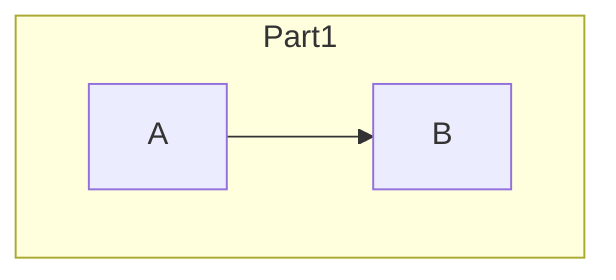
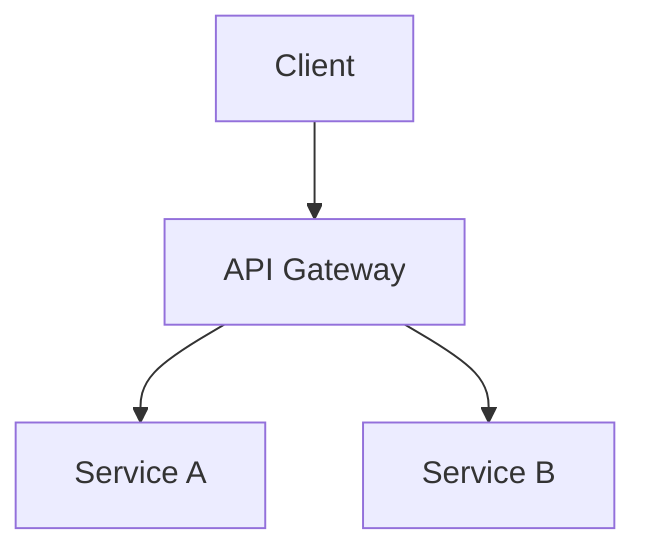

# Knowledge Framework → Notion Formatter Skill

Преобразует markdown-контент в структурированные Notion API blocks с полной поддержкой Knowledge Framework (MECE, BFO ontology) и Mermaid диаграмм.

## When to Use This Skill

**Автоматический триггер:**
- Пользователь просит "отформатировать для Notion"
- Пользователь говорит "конвертировать в Notion blocks"
- Контекст содержит markdown + упоминание Notion API

**Ручной вызов:**
- `/skill knowledge-framework-notion`
- При batch-обработке статей через Windmill + droid exec

## Quick Start Checklist

```markdown
[ ] 1. Получить markdown контент (из краулера или файла)
[ ] 2. Разобрать на структурные элементы (headings, paragraphs, code, lists)
[ ] 3. Детектировать Mermaid блоки (```mermaid или indicators)
[ ] 4. Конвертировать каждый элемент в Notion block object
[ ] 5. Применить лимиты (2000 chars на rich_text, split если нужно)
[ ] 6. Разбить на батчи по 100 blocks
[ ] 7. Вернуть JSON с blocks + metadata
```

**5-Second Decision Tree:**
- Markdown с Mermaid? → Детектировать, конвертировать в code block с language="mermaid"
- Текст >2000 chars? → Split на несколько paragraph blocks
- >100 blocks? → Разбить на batches для sequential API calls

## Markdown → Notion Block Mapping

### Основные элементы

| Markdown | Notion Block Type | Примечания |
|----------|-------------------|------------|
| `# H1` | `heading_1` | Max 2000 chars |
| `## H2` | `heading_2` | Max 2000 chars |
| `### H3` | `heading_3` | Max 2000 chars |
| Paragraph | `paragraph` | Split если >2000 chars |
| `- item` | `bulleted_list_item` | Nested поддерживается |
| `1. item` | `numbered_list_item` | Nested поддерживается |
| `> quote` | `quote` | Max 2000 chars |
| `---` | `divider` | Простой разделитель |

### Code Blocks

| Markdown | Notion Block | Особенности |
|----------|--------------|-------------|
| ` ```mermaid ` | `code` с `language: "mermaid"` | **Notion рендерит автоматически!** |
| ` ```python ` | `code` с `language: "python"` | Syntax highlighting |
| ` ```javascript ` | `code` с `language: "javascript"` | Syntax highlighting |
| ` ```yaml ` | `code` с `language: "yaml"` | Syntax highlighting |
| ` ``` ` (без языка) | `code` с `language: "plain text"` | Fallback |

### Tables

```markdown
| Col1 | Col2 |
|------|------|
| A    | B    |
```

→ Notion `table` block с `table_row` children

## Mermaid Handling (CRITICAL)

### Детектирование Mermaid

¶1 **Явный markdown блок:**
```

```

¶2 **Индикаторы в коде (если язык не указан):**
```python
MERMAID_INDICATORS = [
    "graph TD", "graph LR", "graph TB", "graph BT",
    "flowchart TD", "flowchart LR",
    "sequenceDiagram",
    "classDiagram", 
    "stateDiagram",
    "erDiagram",
    "gantt",
    "pie",
    "mindmap",
    "timeline"
]

def is_mermaid(code_content: str) -> bool:
    return any(indicator in code_content for indicator in MERMAID_INDICATORS)
```

### Notion Block для Mermaid

```json
{
  "type": "code",
  "code": {
    "language": "mermaid",
    "rich_text": [
      {
        "type": "text",
        "text": {
          "content": "graph TD\n    A[Start] --> B[Process]\n    B --> C[End]"
        }
      }
    ]
  }
}
```

**ВАЖНО:** Notion автоматически рендерит Mermaid диаграммы когда `language: "mermaid"`!

### Обработка больших Mermaid (>2000 chars)

¶1 **Стратегия A - Split на subgraphs:**

→ Несколько отдельных code blocks

¶2 **Стратегия B - Упрощение:**
- Убрать styling (`style A fill:#f00`)
- Сократить labels
- Убрать комментарии

¶3 **Стратегия C - Fallback:**
- Если невозможно уместить → вставить как plain text с комментарием

## Notion API Limits (CRITICAL)

### Лимиты на контент

| Параметр | Лимит | Действие при превышении |
|----------|-------|------------------------|
| `rich_text.content` | 2000 chars | Split на несколько text objects |
| `children` в одном запросе | 100 blocks | Batch requests |
| Nested depth | 2 levels | Flatten если глубже |
| URL length | 2000 chars | Truncate с warning |

### Пример split для длинного текста

```python
def split_text_to_rich_text(text: str, max_length: int = 2000) -> list:
    """Split long text into multiple rich_text objects"""
    if len(text) <= max_length:
        return [{"type": "text", "text": {"content": text}}]
    
    chunks = []
    for i in range(0, len(text), max_length):
        chunks.append({
            "type": "text", 
            "text": {"content": text[i:i+max_length]}
        })
    return chunks
```

### Батчинг blocks

```python
def batch_blocks(blocks: list, batch_size: int = 100) -> list:
    """Split blocks into batches for Notion API"""
    return [blocks[i:i+batch_size] for i in range(0, len(blocks), batch_size)]
```

## Output Format (JSON)

### Структура ответа

```json
{
  "success": true,
  "blocks": [
    {
      "type": "heading_1",
      "heading_1": {
        "rich_text": [{"type": "text", "text": {"content": "Article Title"}}]
      }
    },
    {
      "type": "paragraph",
      "paragraph": {
        "rich_text": [{"type": "text", "text": {"content": "First paragraph..."}}]
      }
    },
    {
      "type": "code",
      "code": {
        "language": "mermaid",
        "rich_text": [{"type": "text", "text": {"content": "graph TD\n    A-->B"}}]
      }
    }
  ],
  "batches": [
    [...first 100 blocks...],
    [...next 100 blocks...]
  ],
  "metadata": {
    "total_blocks": 45,
    "mermaid_count": 2,
    "code_blocks_count": 5,
    "headings_count": 8,
    "paragraphs_count": 30,
    "lists_count": 3,
    "requires_batching": false,
    "batch_count": 1
  }
}
```

## Conversion Functions

### Heading

```python
def create_heading_block(text: str, level: int = 1) -> dict:
    """Create Notion heading block (1, 2, or 3)"""
    heading_type = f"heading_{min(level, 3)}"
    return {
        "type": heading_type,
        heading_type: {
            "rich_text": split_text_to_rich_text(text)
        }
    }
```

### Paragraph

```python
def create_paragraph_block(text: str) -> dict:
    """Create Notion paragraph block"""
    return {
        "type": "paragraph",
        "paragraph": {
            "rich_text": split_text_to_rich_text(text)
        }
    }
```

### Code Block

```python
def create_code_block(code: str, language: str = "plain text") -> dict:
    """Create Notion code block with language"""
    # Detect Mermaid if language not specified
    if language == "plain text" and is_mermaid(code):
        language = "mermaid"
    
    return {
        "type": "code",
        "code": {
            "language": language,
            "rich_text": split_text_to_rich_text(code)
        }
    }
```

### Bulleted List

```python
def create_bulleted_list_item(text: str, children: list = None) -> dict:
    """Create Notion bulleted list item"""
    block = {
        "type": "bulleted_list_item",
        "bulleted_list_item": {
            "rich_text": split_text_to_rich_text(text)
        }
    }
    if children:
        block["bulleted_list_item"]["children"] = children
    return block
```

### Quote

```python
def create_quote_block(text: str) -> dict:
    """Create Notion quote block"""
    return {
        "type": "quote",
        "quote": {
            "rich_text": split_text_to_rich_text(text)
        }
    }
```

### Divider

```python
def create_divider_block() -> dict:
    """Create Notion divider block"""
    return {"type": "divider", "divider": {}}
```

## Full Conversion Pipeline

```python
import re
from typing import List, Dict, Any

def markdown_to_notion_blocks(markdown: str) -> Dict[str, Any]:
    """
    Convert markdown content to Notion blocks
    
    Returns:
        {
            "success": bool,
            "blocks": List[dict],
            "batches": List[List[dict]],
            "metadata": dict
        }
    """
    blocks = []
    metadata = {
        "total_blocks": 0,
        "mermaid_count": 0,
        "code_blocks_count": 0,
        "headings_count": 0,
        "paragraphs_count": 0,
        "lists_count": 0
    }
    
    # Split into lines and process
    lines = markdown.split('\n')
    i = 0
    
    while i < len(lines):
        line = lines[i]
        
        # Code block (including mermaid)
        if line.startswith('```'):
            language = line[3:].strip() or "plain text"
            code_lines = []
            i += 1
            while i < len(lines) and not lines[i].startswith('```'):
                code_lines.append(lines[i])
                i += 1
            code_content = '\n'.join(code_lines)
            
            block = create_code_block(code_content, language)
            blocks.append(block)
            
            if block["code"]["language"] == "mermaid":
                metadata["mermaid_count"] += 1
            metadata["code_blocks_count"] += 1
            i += 1
            continue
        
        # Headings
        if line.startswith('# '):
            blocks.append(create_heading_block(line[2:], 1))
            metadata["headings_count"] += 1
        elif line.startswith('## '):
            blocks.append(create_heading_block(line[3:], 2))
            metadata["headings_count"] += 1
        elif line.startswith('### '):
            blocks.append(create_heading_block(line[4:], 3))
            metadata["headings_count"] += 1
        
        # Bulleted list
        elif line.startswith('- ') or line.startswith('* '):
            blocks.append(create_bulleted_list_item(line[2:]))
            metadata["lists_count"] += 1
        
        # Numbered list
        elif re.match(r'^\d+\. ', line):
            text = re.sub(r'^\d+\. ', '', line)
            blocks.append(create_numbered_list_item(text))
            metadata["lists_count"] += 1
        
        # Quote
        elif line.startswith('> '):
            blocks.append(create_quote_block(line[2:]))
        
        # Divider
        elif line.strip() in ['---', '***', '___']:
            blocks.append(create_divider_block())
        
        # Regular paragraph (non-empty)
        elif line.strip():
            blocks.append(create_paragraph_block(line))
            metadata["paragraphs_count"] += 1
        
        i += 1
    
    metadata["total_blocks"] = len(blocks)
    
    # Create batches
    batches = batch_blocks(blocks)
    metadata["requires_batching"] = len(batches) > 1
    metadata["batch_count"] = len(batches)
    
    return {
        "success": True,
        "blocks": blocks,
        "batches": batches,
        "metadata": metadata
    }
```

## Integration with Windmill

### Использование через droid exec

```bash
# В Windmill скрипте
droid exec -f /tmp/format_prompt.md --output-format json --auto low
```

### Prompt template для droid

```markdown
Отформатируй следующий markdown контент в Notion API blocks.

**Title:** {title}
**URL:** {url}

**Content:**
{markdown_content}

**Требования:**
1. Конвертируй в валидные Notion block objects
2. Mermaid блоки → type: "code", language: "mermaid"
3. Соблюдай лимит 2000 chars на rich_text
4. Разбей на батчи по 100 blocks если нужно

**Формат ответа - ТОЛЬКО JSON:**
```json
{
  "blocks": [...],
  "metadata": {...}
}
```
```

## Quality Standards

### Обязательные проверки

- [ ] Все blocks имеют валидный `type`
- [ ] `rich_text` массивы не пустые
- [ ] Mermaid детектирован и помечен `language: "mermaid"`
- [ ] Длинный текст split на chunks ≤2000 chars
- [ ] Батчи ≤100 blocks каждый

### Валидация output

```python
def validate_notion_blocks(blocks: list) -> dict:
    """Validate Notion blocks before API call"""
    errors = []
    
    for i, block in enumerate(blocks):
        if "type" not in block:
            errors.append(f"Block {i}: missing 'type'")
        
        block_type = block.get("type")
        if block_type and block_type not in block:
            errors.append(f"Block {i}: missing '{block_type}' content")
        
        # Check rich_text length
        if block_type in ["paragraph", "heading_1", "heading_2", "heading_3"]:
            rich_text = block.get(block_type, {}).get("rich_text", [])
            for j, rt in enumerate(rich_text):
                content = rt.get("text", {}).get("content", "")
                if len(content) > 2000:
                    errors.append(f"Block {i}, rich_text {j}: exceeds 2000 chars ({len(content)})")
    
    return {
        "valid": len(errors) == 0,
        "errors": errors
    }
```

## Examples

### Input: Simple Article

```markdown
# AI News Summary

This article discusses recent developments in AI.

## Key Points

- Point one about transformers
- Point two about multimodal models

## Conclusion

AI continues to evolve rapidly.
```

### Output: Notion Blocks

```json
{
  "blocks": [
    {"type": "heading_1", "heading_1": {"rich_text": [{"type": "text", "text": {"content": "AI News Summary"}}]}},
    {"type": "paragraph", "paragraph": {"rich_text": [{"type": "text", "text": {"content": "This article discusses recent developments in AI."}}]}},
    {"type": "heading_2", "heading_2": {"rich_text": [{"type": "text", "text": {"content": "Key Points"}}]}},
    {"type": "bulleted_list_item", "bulleted_list_item": {"rich_text": [{"type": "text", "text": {"content": "Point one about transformers"}}]}},
    {"type": "bulleted_list_item", "bulleted_list_item": {"rich_text": [{"type": "text", "text": {"content": "Point two about multimodal models"}}]}},
    {"type": "heading_2", "heading_2": {"rich_text": [{"type": "text", "text": {"content": "Conclusion"}}]}},
    {"type": "paragraph", "paragraph": {"rich_text": [{"type": "text", "text": {"content": "AI continues to evolve rapidly."}}]}}
  ],
  "metadata": {
    "total_blocks": 7,
    "mermaid_count": 0,
    "headings_count": 3,
    "paragraphs_count": 2,
    "lists_count": 2
  }
}
```

### Input: Article with Mermaid

```markdown
# System Architecture



The system uses microservices pattern.
```

### Output: With Mermaid Block

```json
{
  "blocks": [
    {"type": "heading_1", "heading_1": {"rich_text": [{"type": "text", "text": {"content": "System Architecture"}}]}},
    {"type": "code", "code": {"language": "mermaid", "rich_text": [{"type": "text", "text": {"content": "graph TD\n    A[Client] --> B[API Gateway]\n    B --> C[Service A]\n    B --> D[Service B]"}}]}},
    {"type": "paragraph", "paragraph": {"rich_text": [{"type": "text", "text": {"content": "The system uses microservices pattern."}}]}}
  ],
  "metadata": {
    "total_blocks": 3,
    "mermaid_count": 1,
    "code_blocks_count": 1
  }
}
```

---

**Primary source:** Knowledge Framework skill + Notion API documentation
**Version:** 1.0.0
**Created:** 2025-11-25
